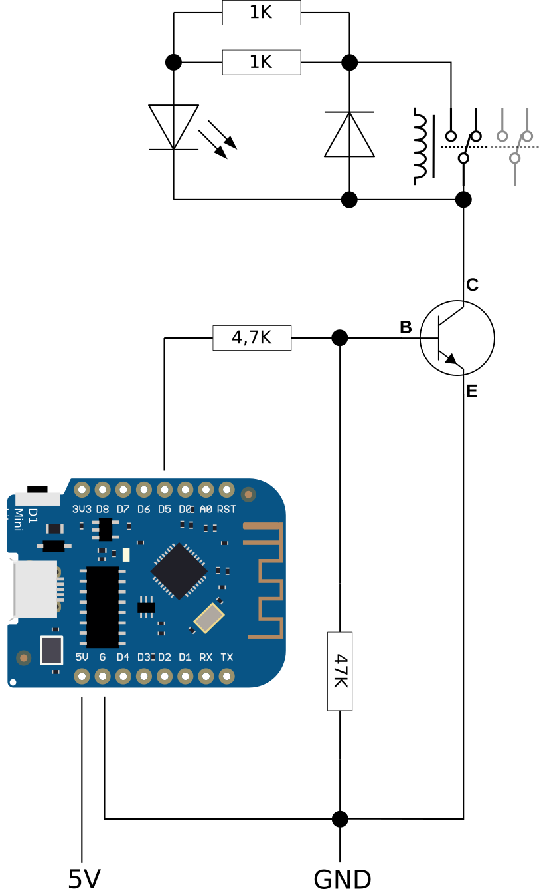
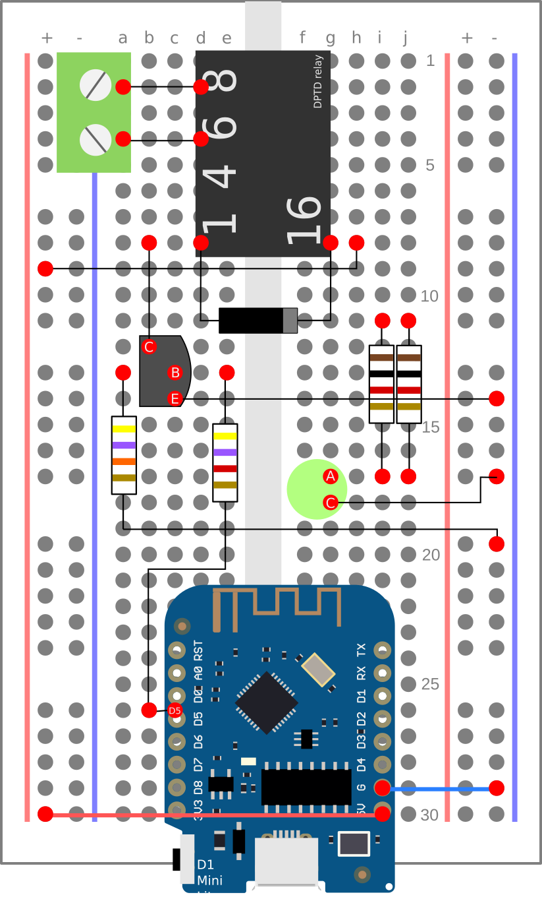

# Heater thermostat

This repository contains the code and the steps to set up a heater control system based on a MQTT switch (which turns on/off the heater) and a MQTT temperature and humidity sensor. Both devices are "managed" by a HomeAssistant instance present in the local network.

The roles of each component are:
* Temperature sensor: using a DHT22 temperature+humidity sensor attached to a WeMos D1 board, we measure the temp and humidity every certain time and publish both of them to a MQTT topic.  
* Heater switch: The switch is actually a MQTT topic subscriber. When a certain message is published to the topic the switch is subscribed to, the switch is opened or closed. When closed, the heater will turn on and vice-versa.
* HomeAssistant instance: This will be the "thermostat" itself, as it will be a subscriber to the temp+humidity topic and a publisher to the switch topic. When the temperature goes below a certain threshold, it will publish a "ON" message in the topic the switch is subscribed to, activating the heater. Conversely, when the measured temperature goes above the threshold, a "OFF" message will be published to the swith topic, deactivating the heater.

## Before anything else: configure your Arduino IDE
* Download latest version of Arduino IDE.
* Open it, add the libraries for DHT22 sensor.
* Add board repository for Wemos D1: `https://arduino.esp8266.com/stable/package_esp8266com_index.json`
* Your Linux user should be part of `tty` Unix group.
* Use Wemos D1 R1 as target board.

### Arduino flashing configuration

* Board: LOLIN(WEMOS) D1 mini Lite
* Upload speed: 115200 bauds

## Temperature and humidity sensor

We need:

* A Wemos D1 board (or any ESP8266 based board)
* A DHT22 sensor
* Recommended: a prototiping board
* Arduino IDE to program the Wemos board

First, if needed, weld the connectors to your board. Then put it over a prototyping board and wire the Wemos board to the DHT22 sensor:
* 5V terminal of the Wemos to + terminal of the DHT sensor.
* 0 (or GND, depending on the Wemos board model) to the - terminal of the DHT sensor.
* A data terminal (e.g. D0 terminal) to the data terminal of the DHT sensor.

Then, it's time to flash the Wemos with the software which will publish to a MQTT topic the temperature and humidity read from the DHT22 sensor. It's DHTYou will need the DHT, ESP8266WiFi and PubSubClient libraries in order to connect the board to your home WiFi network and make this sensor a MQTT publisher. Optionally, you can define a user and password if your MQTT distribution is secured.

## MQTT switch

In my case, the MQTT switch is a homemade one. I've been inspired in [this guide _How to control a relay with a transistor_ (in Spanish)](https://www.inventable.eu/controlar-rele-con-transistor/). The idea is to activate a relay (basically, a switch) using one of the pins of the WEMOS D1. That pin will output 5V when some event occurs (in out case, when a certain message is published to the topic our switch is subscribe to). As the relay will not change it's state with the 5V of the WEMOS pin, we need to amplify that voltage. There is where the transistor takes place. 

The idea is have a circuit like the one shown below:

We will need the following components:

* A WEMOS D1 board
- HFD27/005S relay (one of the switches will remain unused)
- 1N400x (x = 4, 5,6,7) diode
- 1 LED for check status
- 2 1K resistance
- 1 4K7 resistance
- 1 47K resistance
- 1 BC547, BC548 or BC337 transistor
- 1 terminal block

In a breadboard will look like this:

# Acknowledgements

JCGB, for his guide assembling this circuits.
